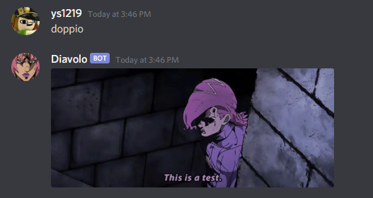
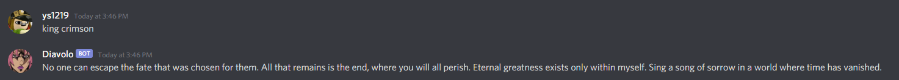

# diavolobot

this bot just does three simple things:
1. prints diavolo

2. sends a screenshot of doppio

3. prints diavolos monologue

if you want to track changes via webhooks (discord, etc.) just dm me on discord at ys1219#7277